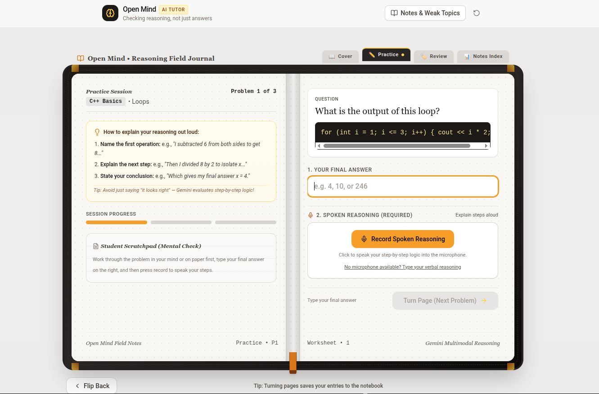
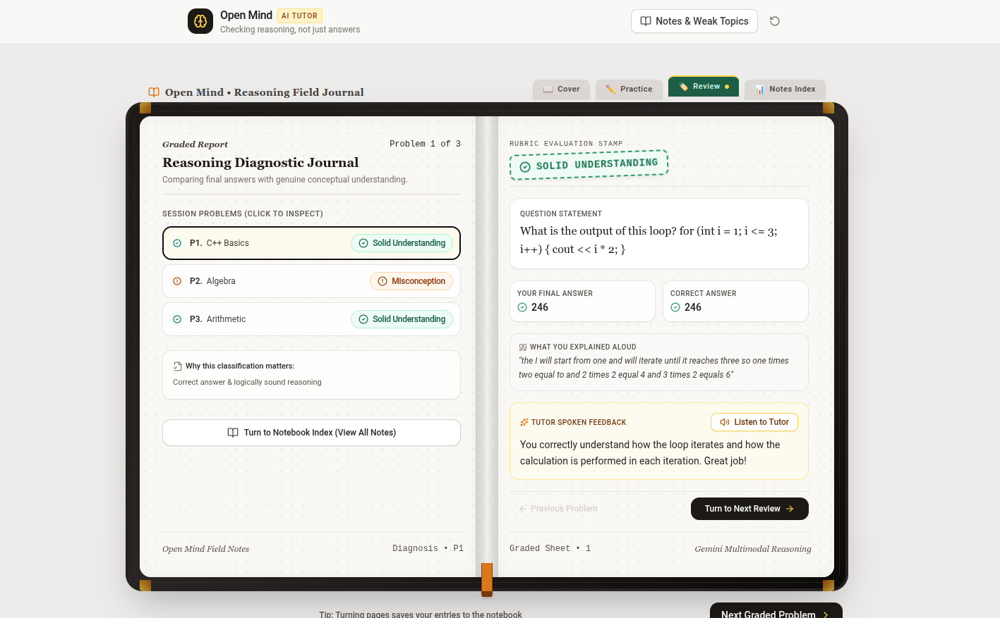
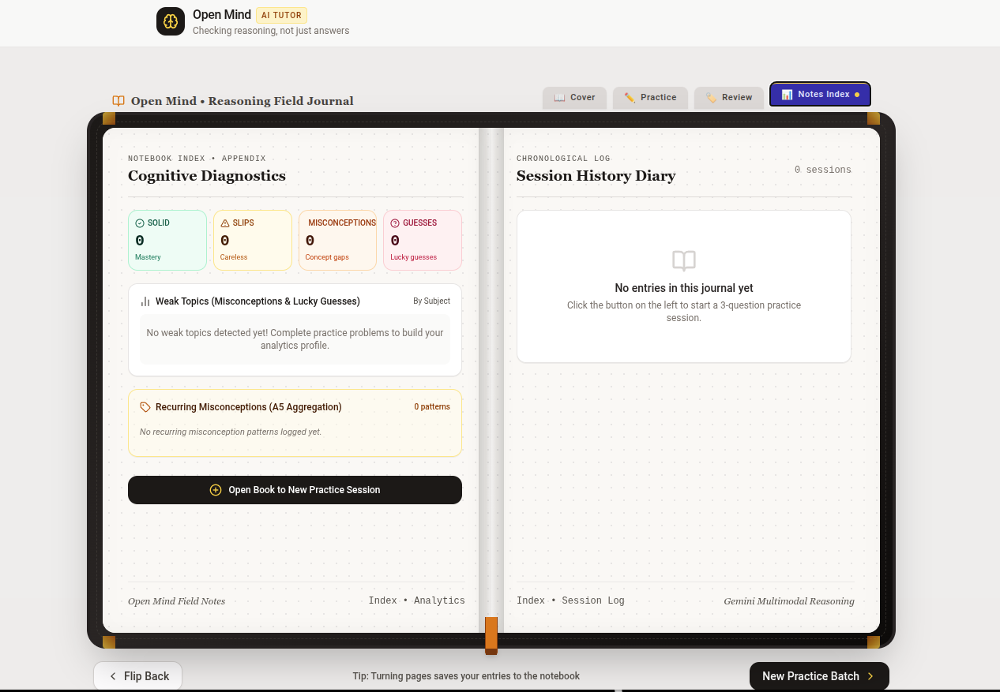

<div align="center">

# Open Mind

**Multimodal reasoning analysis for practice problems**

Evaluating how a student thinks, not just the final number they submit.

[](https://vercel.com/new)
[](https://vitejs.dev/)
[](https://react.dev/)
[](https://www.typescriptlang.org/)
[](https://tailwindcss.com/)
[](https://aistudio.google.com/)

</div>

---

## Overview

Most online assessment tools only check whether the final answer matches an expected string or number. This creates three common problems:

1. **Lucky guesses** are marked correct even when the student has no idea how the problem works.
2. **Careless slips** (like a basic arithmetic mistake at the final step) are marked as total failures, ignoring sound conceptual reasoning.
3. **Flawed logic** that happens to land on the correct answer goes completely undetected.

**Open Mind** changes this by asking students to explain their thought process out loud. The audio explanation is transcribed and evaluated alongside the submitted answer using Gemini multimodal models to diagnose actual understanding.

---

## Screenshots

<div align="center">

### Interactive Problem Solving & Voice Recording
*Solve the problem, record spoken reasoning, or adjust the live transcript.*



<br/><br/>

### Reasoning Breakdown & Diagnostic Feedback
*Independent assessment of the reasoning path, highlighting relevant question text and explaining misconceptions.*



<br/><br/>

### Session History & Study Notes
*Track past attempts, identify recurring patterns, and review key takeaways.*



</div>

---

## Classification Categories

Every student attempt is analyzed across both the final answer and the reasoning transcript, sorting the result into one of five categories:

| Category | Description | Feedback Approach |
|---|---|---|
| **Solid Understanding** | Correct answer backed by valid logical steps. | Confirms mastery and reinforces the correct method. |
| **Careless Slip** | Sound conceptual reasoning undermined by a mechanical error. | Acknowledges correct logic and isolates the calculation or formatting slip. |
| **Misconception** | Invalid logical steps or conceptual misunderstanding. | Identifies where the reasoning broke down and explains the concept simply. |
| **Lucky Guess** | Correct answer, but reasoning is absent, vague, or illogical. | Prompts the student to explain the steps behind the answer. |
| **Unclear** | Audio was silent, inaudible, or too brief to evaluate. | Invites the student to re-record with a fuller explanation. |

---

## Features

- **Direct Audio Ingestion**: Records and sends raw audio (`audio/webm`) directly to Gemini multimodal endpoints without requiring client-side speech recognition.
- **Model Fallback Cascade**: Automatically cycles through compatible Gemini models (`gemini-2.5-flash-lite`, `gemini-3.5-flash`, etc.) to mitigate rate limits and ensure uptime.
- **Context Highlighting**: Extracts relevant excerpts from problem text directly tied to where the student struggled.
- **Server-Side Key Protection**: All Gemini requests are executed within serverless endpoints (`/api/*`); API keys are never exposed in client bundles.
- **Vercel Serverless Ready**: Packaged for zero-maintenance Vercel deployment alongside a static React frontend.

---

## Architecture

```text
open-mind/
├── api/                     # Vercel serverless functions
│   ├── _lib/
│   │   └── gemini.ts        # Shared Gemini client, prompt instructions, and fallback cascade
│   ├── analyze.ts           # POST /api/analyze (reasoning evaluation)
│   ├── transcribe.ts        # POST /api/transcribe (audio transcription)
│   └── health.ts            # GET /api/health (service check)
├── images/
│   └── screenshots/         # Documentation previews
├── src/                     # React 19 application
│   ├── components/          # UI components
│   ├── data/                # Sample questions and practice sets
│   ├── services/            # API client layer
│   ├── App.tsx              # Root component
│   └── main.tsx             # Entry point
├── vercel.json              # Vercel routing and SPA fallback
├── vite.config.ts           # Build config with local dev API middleware
└── package.json
```

---

## Local Setup

### Prerequisites
- Node.js 18+
- A [Gemini API Key](https://aistudio.google.com/app/apikey) from Google AI Studio

### 1. Clone and Install
```bash
git clone https://github.com/Omar-Sameh-m/open-mind.git
cd open-mind
npm install
```

### 2. Configure Environment Variables
Create a `.env` file from the example:
```bash
cp .env.example .env
```

Add your Gemini API key:
```env
GEMINI_API_KEY="your_api_key_here"
```

### 3. Start the Dev Server
```bash
npm run dev
```

Open `http://localhost:5173` in your browser. The Vite development server automatically routes `/api/*` endpoints to the serverless handlers locally.

To verify your API key is recognized locally:
```bash
curl http://localhost:5173/api/health
# {"status":"ok","hasApiKey":true}
```

---

## Deployment to Vercel

### Option 1: Via Vercel Dashboard

1. Push your repository to GitHub.
2. Go to [vercel.com](https://vercel.com) and click **Add New Project**.
3. Import the `open-mind` repository.
4. Vercel automatically detects the Vite configuration:
   - **Framework Preset**: `Vite`
   - **Build Command**: `vite build`
   - **Output Directory**: `dist`
5. Under **Environment Variables**, add:
   - `GEMINI_API_KEY`: your Google Gemini API key
6. Click **Deploy**.

### Option 2: Via Vercel CLI

```bash
npm install -g vercel
vercel
vercel env add GEMINI_API_KEY
vercel --prod
```

---

## Environment Variables

| Variable | Required | Description | Source |
|---|---|---|---|
| `GEMINI_API_KEY` | Yes | Google Gemini API key used for multimodal voice analysis and reasoning classification. | [Google AI Studio](https://aistudio.google.com/app/apikey) |

---

## Available Scripts

- `npm run dev` — Starts the local dev server with full API parity.
- `npm run build` — Builds the static application into `dist/`.
- `npm run preview` — Previews the built production assets locally.
- `npm run lint` — Runs TypeScript compiler checks without emitting files.

---

## License

MIT © [Omar Sameh](https://github.com/Omar-Sameh-m)
